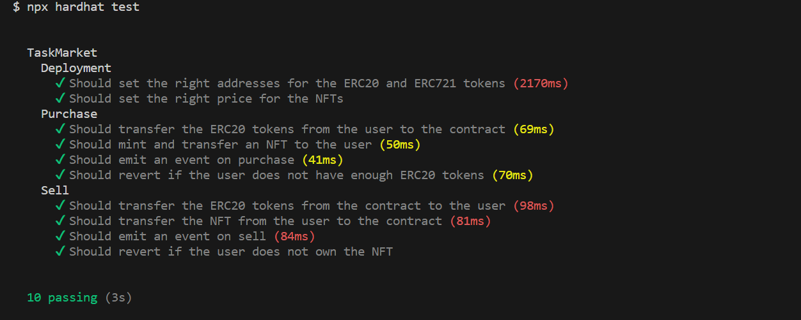

**Task- Smart Contract Development**

**Objective:** Create a smart contract that initializes an already created ERC20 token and an ERC721 token and implement the following functions:

==> Created TaskMaster.sol which initializes ERC20 token (TaskTokenERC20) and ERC721 token (TaskTokenERC721)

1. **Purchase** : Implement a function where a user can deposit a specific amount (which you may initialize) of ERC20 tokens, and the function mints an NFT token to the user. ==>Done
2. **Sell:** Create a function where a user deposits an NFT and receives some ERC20 tokens in return. ==>Done

**Instructions:**

- Develop the project within a Truffle/Hardhat environment. ==>Done (Used Harhat)
- Write test cases supporting the above functions.==>Done
- Migrate the smart contracts to any test network.==>Done (Deployed on Polygon Mumbai Testnet)

  Deployed Contract Address (Verified) :
  TaskTokenERC20 : [https://mumbai.polygonscan.com/address/0xa4cDC0e4ed400794f9C08dBfEE4e3bdc6C50d708
  ]()TaskTokenERC721 : [https://mumbai.polygonscan.com/address/0x6F8Dd3cD472f4E412aB68002E5e10bd4Ef9F1d57
  ]()TaskMarket : [https://mumbai.polygonscan.com/address/0xda9a8521c186220b28060ed1cc24f6eeb59c4601]()
- Purchase Txn Hash : [https://mumbai.polygonscan.com/tx/0xebe2e06567ec6577c020664a08332e09615f880551857f27f7ebca5fe0f7847d]()
- Sell Txn Hash : [https://mumbai.polygonscan.com/tx/0x4cd96e355fd32af26b84181020323a1aabf598547a946e68f9e58559f0db52d3]()

  Test Screenshot-

  
